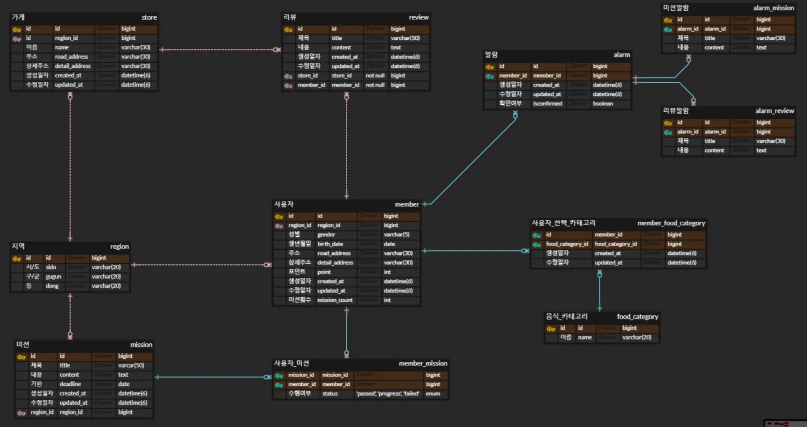

# 유채원 / 워크북 week01 - ERD설계

1. 가장 먼저 모든 ERD의 중심이 되는 member(사용자)를 설계한다.
    
    주어진 자료를 통해 성별, 생년월일, 주소를 컬럼으로 넣고 주소는 도로명(지번)/상세주소로 분리한다. 생성일자와 수정일자를 추가하고 생년월일은 yy-mm-dd 형식인 date를 사용한다.
    

1. 사용자는 여러개의 카테고리를 고를 수 있고 하나의 카테고리 역시 여러 사용자가 선택할 수 있기 때문에, 다대다 관계가 성립된다. 두 엔터티를 연결하는 user_food_category를 통해 n:m 관계를 설정한다.

1. 가게 - 지역 - 사용자
    
    제공된 피그마 이미지를 보면 ‘동’을 기준으로 가게가 분류된다.
    
    지역: 시/도, 구/군, 동 필드를 갖는 테이블로 설계한다.
    
    가게: ‘동’별로 가게를 구분하기 위해 region테이블과의 1:n관계를 설정한다.
    
    단, 지도 상의 위치 표현, 정보를 위해 주소(도로명/지번)와 상세주소 컬럼을 따로 생성한다.
    
    사용자: 사용자가 어떤 지역에 속해있는 지를 알아야 그에 맞는 가게를 선별할 수 있기 때문에 
    
    지역과 사용자 역시 1:n관계를 설정해준다. (위와 동일한 이유로 주소, 상세주소 컬럼 생성)
    

**지역을 별도의 테이블로 관리하는 이유**

> → 만일 지역이 없어도 member 나 store에 있는 주소로 ‘동’을 뽑아내는 로직을 구현하면 된다. 그러나 처음 회원가입 시(혹은 주소 변경)에 한 번 지역_id를 넣어주는 것으로 인해 추후에는 문자열을 검사할 필요없이 id만 조회하면 되기 때문에 훨씬 더 효율적이다.
> 

1. 미션 테이블: 지역별(동)로 등록된 가게가 동일하기 때문에 주어진 미션이 같다고 가정, 그렇다면 지역과 미션은 1:m 관계를 갖는다(한 미션은 여러 지역에 나타날 수 없음)
    
    미션과 사용자는 n:m관계를 갖고, 사용자별 미션이 수행되었는지를 기록해야하기 때문에 member_mission테이블 생성 미션과 사용자의 pk가 사용자_미션 테이블의 복합키가 되므로, 식별자 관계로 설정한다.
    

1. 알람 - 미션알람 / 리뷰 알람을 서브 타입으로 분리해 테이블 생성

** 전체 ERD의 구조는 다음과 같다 **