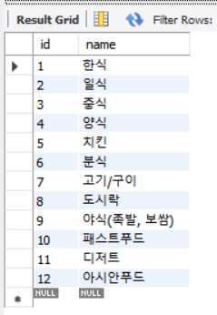

# week05-[코채/유채원]

- 테이블 생성하기
    
    
    ```sql
    --food-category 테이블--
    CREATE TABLE food_category (
        id BIGINT PRIMARY KEY AUTO_INCREMENT,
        name VARCHAR(15),
    );
    ```
    
    
    
    ```sql
    CREATE TABLE mission (
        id BIGINT PRIMARY KEY AUTO_INCREMENT,
        store_id BIGINT,
        reward INT,
        deadline DATETIME,
        mission_spec TEXT,
        created_at DATETIME DEFAULT CURRENT_TIMESTAMP,
    		updated_at DATETIME DEFAULT CURRENT_TIMESTAMP ON UPDATE CURRENT_TIMESTAMP,
        FOREIGN KEY (store_id) REFERENCES store(id)
    );
    ```
    
    
    
    ```sql
    CREATE TABLE region (
        id BIGINT PRIMARY KEY AUTO_INCREMENT,
        name VARCHAR(20),
        created_at DATETIME DEFAULT CURRENT_TIMESTAMP,
    		updated_at DATETIME DEFAULT CURRENT_TIMESTAMP ON UPDATE CURRENT_TIMESTAMP
    );
    ```
    
    
    
    ```sql
    CREATE TABLE review (
        id BIGINT PRIMARY KEY AUTO_INCREMENT,
        user_id BIGINT,
        store_id BIGINT,
        body TEXT,
        score FLOAT,
        created_at DATETIME DEFAULT CURRENT_TIMESTAMP,
    		updated_at DATETIME DEFAULT CURRENT_TIMESTAMP ON UPDATE CURRENT_TIMESTAMP,
    		//수정 허용 안하는 방식도 고려
        FOREIGN KEY (member_id) REFERENCES member(id),
        FOREIGN KEY (store_id) REFERENCES store(id)
    );
    ```
    
    
    
    ```sql
    CREATE TABLE store (
        id BIGINT PRIMARY KEY AUTO_INCREMENT,
        region_id BIGINT,
        name VARCHAR(50),
        address VARCHAR(50),
        score FLOAT,
        created_at DATETIME DEFAULT CURRENT_TIMESTAMP,
    		updated_at DATETIME DEFAULT CURRENT_TIMESTAMP ON UPDATE CURRENT_TIMESTAMP,
        FOREIGN KEY (region_id) REFERENCES region(id)
    );
    ```
    
    
    
    ```sql
    CREATE TABLE terms (
        id BIGINT PRIMARY KEY AUTO_INCREMENT,
        title VARCHAR(20),
        body TEXT,
        optional BOOLEAN,
        created_at DATETIME(6),
        updated_at DATETIME(6)
    );
    ```
    
    
    
    ```sql
    CREATE TABLE user (
        id BIGINT PRIMARY KEY AUTO_INCREMENT,
        email VARCHAR(50),
        name VARCHAR(20),
        gender VARCHAR(10),
        birth VARCHAR(10),
        address VARCHAR(40),
        detail_address VARCHAR(40),
        phone_number VARCHAR(13),
        //status VARCHAR(15),
        //inactive_date DATETIME(6),
        //social_type VARCHAR(10),
        created_at DATETIME(6),
        updated_at DATETIME(6),
        point INT default 0
    );
    ```
    
    
    
    ```sql
    CREATE TABLE user_category (
        id BIGINT PRIMARY KEY AUTO_INCREMENT,
        user_id BIGINT,
        food_category_id BIGINT,
        FOREIGN KEY (user_id ) REFERENCES user(id),
        FOREIGN KEY (food_category_id ) REFERENCES food_category(id)
    );
    ```
    
    
    

** index.js → controller → service → repository / dto 방향으로 구현하였습니다

** 1번 사용자로 로그인되어 토큰이 header로 전송된다는 가정하에, user_id를 1로 하드코딩하였습니다.

### 의문.

1. conn은 선언하고 왜 안쓰는가?
2. user[0]을 안하면 출력이 안되는데?
    
    →user.repository 50번쯤 라인에 배열 원소 [0]으로 지정해야 됨
    

### 1-1. 특정 지역에 가게 추가하기 API

- API 구현 전 고민한 부분
    - region table을 어떻게 설계할 것 인가?
        - 우선 서울에 있는 ‘구’를 중심으로 설계 실제로 프로젝트를 진행한다면 행정코드를 
        csv로 다운받아 db에 넣는 방식
    - 특정 지역을 클라이언트 측에서 어떻게 받을 것인지?
        - 변경 전: 클라이언트 측에서 region_id 받기
        - 변경 후: 가게를 등록하는 사용자로부터 ‘강남구’와 같이 입력 받으면 region 테이블의 해당 지역의 region_id를 찾아 store에 입력하는 로직 구현 / 마찬가지로 실 프로젝트에서는 행정코드나 주소에서 ‘구’를 분리하는 로직 따로 설계
    - 중복 검사를 어떻게 할 것인가?
        - 사업자번호로!
    - 가게에 score 초기 값을 0으로 하면 리뷰가 0점인지, 새로 생성된 가게인지 어떻게 파악하지?
        - 리뷰의 개수를 카운트해서 0이면 새로 생긴 가게임을 표시!
- 1.1 API 설계 및 구현
    
    
    
    index.js 에 handleStoreCreate 등록 api endpoint는 /api/v1/stores로 지정
    
    ```jsx
    **// <store.controller.js>**
    
    import { StatusCodes } from "http-status-codes";
    import { bodyToStore } from "../dtos/store.dto.js";
    import { storeCreate } from "../services/store.service.js";
    
    export const handleStoreCreate = async (req, res, next) => {
        console.log("가게를 추가했습니다!");
        console.log("body:", req.body);
    
        const store = await storeCreate(bodyToStore(req.body));
        res.status(StatusCodes.OK).json({ result: store });
    }
    ```
    
    controller에서는 handleStoreCreate 함수를 구현합니다. 
    
    개발자용 log를 남기고, service의 storeCreate 함수를 통해 store객체를 생성합니다. storeCreate함수의 인자로는 dto의 bodyToStore를 사용하며 클라이언트로부터 받은 request body를 인자로 넘깁니다.
    
    그럼 이제 index.js → controller까지의 로직은 완성이 되었고, 내부 실제 로직을 구현해줄 service와 데이터 처리를 해줄 dto가 필요합니다.
    
    store.dto를 보겠습니다.
    
    ```jsx
    **//<store.dto>**
    export const bodyToStore = (body) => {
    
      return {
        region_id: body.region_id, 
        region_name: body.region_name,
        name: body.name, 
        score: body.score, 
        address: body.address,
        business_number: body.business_number
      };
    };
    
    export function responseFromStore(store) {
      return {
        id: store.id,
        name: store.name,
      };
    }
    ```
    
    request body를 bodyToStore 함수의 인자로 넘겨주면 body에서 필요한 값들을 꺼내 각 필드로 넣어 return합니다. ← 클라이언트로부터 받은 데이터를 삽입할 데이터로 가공
    
    데이터를 정상적으로 처리하고 다시 클라이언트에게 필요한 데이터를 반환해주기 위한 reponseFromStore 함수도 구현하여 간단히 id와 name을 넘겨줍니다.
    
    그럼 이제 index.js → controller → (dto) 까지 로직에 필요한 것들이 모두 준비되었고 (repo제외),
    
    store.service에 핵심 로직을 구현합니다.
    
    ```jsx
    **//<store.service>
    import { responseFromStore } from "../dtos/store.dto.js";
    import {
      addStore,
      getStore,
    } from "../repositories/store.repository.js";
    
    export const storeCreate = async (data) => {
      const createdStoreId = await addStore(data);
    
      if (createdStoreId === null) {
        throw new Error("이미 존재하는 가게입니다.");
      }
    
      const store = await getStore(createdStoreId);
      console.log("store from getStore:", store);
    
      return responseFromStore(store);
    };**
    ```
    
    main function(진짜 메인 함수라는 건 아니고,, 중요하다는,, ) 인 storeCreate함수를 구현합니다. 
    storeCreate에 data를 인자로 넣어주는데 여기서 인자는 아까 만들어준 dto가 들어가겠죠?
    
    이때 null을 반환하면 중복 에러를 던집니다.( 이따가 repo에서 중복 검사 함 )
    
    →중복검사는 business_number(사업자번호)로 합니다
    
    추가하고 받은 createdStoreId를 이용해서 store를 조회하고 responseFromStore에 담아서 줍니다.
    
    그럼 결국 이걸 호출한 controller에서 return값을 받고 클라이언트에게 response로 응답합니다.
    
    repository의 sql문을 한번 봅시다.
    
    - 전체 코드( 이 안에 중복 검사, getStore 있음)
        
        ```
        import { pool } from "../db.config.js";
        
        export const addStore = async (data) => {
          const conn = await pool.getConnection();
        
          try {
            const [confirm] = await pool.query(
              `SELECT EXISTS(SELECT 1 FROM store WHERE business_number = ?) as isExistStore;`,
              [data.business_number]
            );
        
            if (confirm[0].isExistStore) {
              return null;
            }
        
            const [result] = await conn.query(
              `
              INSERT INTO store (business_number, region_id, name, address)
              SELECT ?, r.id, ?, ?
              FROM region r
              WHERE r.name = ?
              `,
              [data.business_number, data.name, data.address, data.region_name]
            );
        
            return result.insertId;
        
          } catch (err) {
            throw new Error(
              `오류가 발생했어요. 요청 파라미터를 확인해주세요. (${err})`
            );
          } finally {
            conn.release();
          }
        };
        
        export const getStore = async (storeId) => {
          const conn = await pool.getConnection();
        
          try {
            const [store] = await pool.query(`SELECT * FROM store WHERE id = ?;`, storeId);
        
            console.log(store);
        
            if (store.length == 0) {
              return null;
            }
        
            return store[0];
            //return store;
          } catch (err) {
            throw new Error(
              `오류가 발생했어요. 요청 파라미터를 확인해주세요. (${err})`
            );
          } finally {
            conn.release();
          }
        };
        
        ```
        
    
    ```jsx
     const [result] = await conn.query(
          `
          INSERT INTO store (business_number, region_id, name, address)
          SELECT ?, r.id, ?, ?
          FROM region r
          WHERE r.name = ?
          `,
          [data.business_number, data.name, data.address, data.region_name]
        );
    ```
    
    주 sql 문을 보면, region 테이블에서 name이 입력받은 값과 같은 지역을 찾아 해당 id를 넣어줍니다.
    
    그럼 이제 만든 api를 postman을 통해 확인합니다.
    
    
    
    
    
    성공!
    

### **1-2. 가게에 리뷰 추가하기 API**

- 리뷰를 추가하려는 가게가 존재하는지 검증이 필요합니다.
    
    → pathvariable로 storeId 받아서 store테이블에 있는 지 확인 하는 로직 구현
    
- 미션 수행 중 수정한 부분: 리뷰 추가 후에 store의 score update
- 1.2 API 설계 및 구현
    
    
    
    마찬가지로 index.js에 handler를 등록합니다. 이름은 handleReviewCreate입니다.
    
    이 전의 api들과 다른 점이 있다면 storeId를 pathvariable로 받는다는 점입니다.
    
    이 전 api들과 중복되는 부분은 생략하고 pathvariable을 중점으로 리뷰하도록 하겠습니다.
    
    handleReviewCreate를 만들기 위해 review.controller를 구현합니다.
    
    ```jsx
    **//<review.controller>**
    import { StatusCodes } from "http-status-codes";
    import { bodyToReview } from "../dtos/review.dto.js";
    import { reviewCreate } from "../services/review.service.js";
    
    export const handleReviewCreate = async (req, res, next) => {
        const store_id = req.params.storeId;
        console.log("리뷰를 추가했습니다!");
        console.log("body:", req.body);
        const entireReviewData = {
            ...req.body,
            store_id,  // pathvariable
        };
    
        const review = await reviewCreate(bodyToReview(entireReviewData));
        res.status(StatusCodes.OK).json({ result: review });
    }
    ```
    
    여기서 다른 점은 req.params.storeId로 pathvariable을 변수로 받아서 entireReviewData에서 body와 pathvaraible을 합친 entireReviewData를 만들어준다는 점입니다.
    
    ** req.body앞의 점 세개를 붙여야 데이터가 펼쳐져서 모든 필드가 들어갈 수 있습니다.
    
    dto는 크게 다른 점이 없고 repository의 addReview에서 중복 검사하는 부분을 보겠습니다.
    
    ```jsx
      try {
        const [confirm] = await pool.query(
          `SELECT EXISTS(SELECT 1 FROM store WHERE id = ?) as isExistStore;`,
          [data.store_id]
        );
        //pathvaraible로 받은 store_id로 해당 가게가 존재하는 지 검사합니다.
    
        //가게가 있는 지 검증
        if (!confirm[0].isExistStore) {
          return null;
        }
    
    ```
    
    리뷰 작성하면 가게의 score가 변경되는 부분 
    
    ```jsx
    // 평균 점수 계산
        const [[average]] = await conn.query(
          `SELECT AVG(score) FROM review WHERE store_id = ?;`,
          [data.store_id]
        );
    
        const newAvgScore = average.avgScore;
    
        // store 테이블에 평균 평점 업데이트
        await conn.query(
          `UPDATE store SET score = ? WHERE id = ?;`,
          [newAvgScore, data.store_id]
        );
    ```
    
    
    
    다음과 같이 postman에서 api요청이 정상적으로 이루어지는 것을 알 수 있습니다.
    
    ```powershell
    <console.log>
    리뷰를 추가했습니다!
    body: { body: '맛있어요', score: 4.5 }
    **store 평균 평점이 4.276923069587121점으로 업데이트 되었습니다.**
    [
      {
        id: 45,
        user_id: 19,
        store_id: 21,
        body: '맛있어요',
        score: 4.5,
        created_at: 2025-10-15T02:38:34.496Z,
        updated_at: 2025-10-15T02:38:34.496Z
      }
    ]
    ```
    

### 1-3. 가게에 미션 추가하기 API

- 1.3 API 설계 및 구현
    
    
    
    리뷰와 마찬가지로 storeId를 pathvariable로 받아서 핸들러를 등록합니다.
    
    ```jsx
    export const bodyToMission = (body) => {
        const deadline = new Date(body.deadline); //날짜 변환
    
        return {
            store_id: body.store_id, 
            reward: body.reward,
            deadline, 
            mission_spec: body.mission_spec,
        };
    };
    ```
    
    나머지는 이 전 api들과 유사하여 리뷰를 생략하겠습니다.
    
    
    
    정상적으로 api가 요청되고 응답이 오는 것을 확인할 수 있다
    
    
    
    실제로 없는 가게인 id 100을 입력하면 해당 가게가 존재하지 않습니다. 오류 메세지가 출력된다.
    

### **1-4. 가게의 미션을 도전 중인 미션에 추가(미션 도전하기) API**

- 도전하려는 미션이 이미 도전 중이지는 않은지 검증이 필요합니다.
    - user_mission table에 해당 mission_id가 존재하는 지 확인함
- ~~1-3번 API를 구현하지 않은 경우, 1-4번에서는 DB에 미션 정보를 수동으로 기입한 후 진행해야 합니다.~~
- 1.4 API 설계 및 구현
    
    
    
    마지막으로 mission을 진행 중인 미션에 추가하는 api에 대한 설명입니다.
    
    저는 진행 중인 미션에 추가하는 api라는 문항을 미션 테이블에 있는 mission_id를 user_mission 테이블에 해당 user의 id와 상태(in_progress, completed)를 같이 insert하는 것으로 이해하고 진행했습니다.
    
    우선 /api/v1/missions/:missionId/challenge 주소에 진행하고자 하는 미션의 id를 pathvariable로 받게끔 설계하였습니다.
    
    가게가 미션을 추가하는 것과 미션의 상태를 변경하는 것을 같은 mission이라는 범주로 판단하여, 기존에 있던 missioncontroller, missiondto, missionservice에 코드를 추가하는 방식으로 진행했습니다.
    
    ```jsx
    export const bodyToChallenge = (body) => {
    
        return {
            mission_id: body.mission_id, 
        };
    };
    //사실상 requestbody에 내용은 없고, pathvariable로 받은 mission_id만 있으면 됩니다.
    ```
    
    다른 부분은 다 유사하기때문에 addChallenge에서 이미 도전 중인지 확인하는 부분만 리뷰하겠습니다.
    
    ```jsx
    export const addChallenge = async (data) => {
      const conn = await pool.getConnection();
    
      try {
         const [confirm] = await pool.query(
            `SELECT EXISTS(SELECT 1 FROM user_mission WHERE mission_id = ? 
            AND status = 'in_progress') as isExistChallenge;`,
            [data.mission_id]
        );
        //해당 mission_id가 존재하면서 상태가 in_progress 인 것이 존재하는 지 확인
    
        if (confirm[0].isExistChallenge) {
          return null;
        }
    
        const [result] = await conn.query(
            `INSERT INTO user_mission ( mission_id, user_id, status) VALUES ( ?, ?, ?);`,
          [ data.mission_id, 1, "in_progress" ]
        );
    ```
    
    
    
    정상적으로 처리되는 것을 확인할 수 있다.
    
    
    
    다시 요청하면 진행중인 미션임을 확인 가능
    
- 2. Controller → Service → Repository → DB로 이어지는 요청 흐름을 정리해 주세요.
    
    **1. 클라이언트가 요청을 보냄**
    
    - 예: 사용자가 POST api/v1/users/signup API 호출
    
    **2. Express 라우터가 요청을 해당 Controller로 전달**
    
    - 요청 URL과 메서드에 맞는 Controller 함수가 실행됨
    
    **3. Controller 로직 수행**
    
    - 요청 파라미터, 바디 등을 추출 (예: `req.params.id`)
    - 유효성 검사
    - 관련 Service 계층 메서드를 호출해서 로직 처리를 위임
    
    **4. Service 계층이 비즈니스 로직을 처리**
    
    - Controller로부터 받은 데이터를 바탕으로 처리 시작
    - 예외 상황 처리 (없는 사용자, 권한 없음 등)
    - 필요한 데이터를 얻기 위해 Repository 메서드를 호출
    
    **5. Repository 계층이 데이터베이스와 통신(DTO)**
    
    - Service로부터 받은 요청에 따라 DB 쿼리를 수행
    - 예: 특정 ID의 사용자 조회, 조건에 맞는 데이터 검색, 삽입/수정 등
    
    **6. DB 처리**
    
    - Repository가 SQL 실행 → DB가 응답 → 결과를 Repository로 반환
    
    **7. Repository가 결과 데이터를 Service로 반환**
    
    **8. Service가 로직 처리하고 Controller로 반환**
    
    **9. Controller가 응답을 구성하여 클라이언트에 전송**
    
    - 적절한 HTTP status code 설정
    - JSON 응답으로 전송
    
- 회원가입 API에 비밀번호 해싱 과정 추가
    
    bcrypt 사용
    
    1. Salt(난수)를 자동으로 생성
    2. 비밀번호 + Salt를 조합해서 해시 생성
    3. 그 결과는 항상 다르다  (같은 비밀번호여도)
    
    그럼 어떻게 다시 비교하는가?
    
    해싱 결과 값에는 **사용된 salt 값이 포함**되어 있음
    
    로그인 시 bcrypt는 이 salt를 다시 사용해서 비교함
    
    - 수정 코드
        
        ```jsx
        import bcrypt from "bcrypt";
        //. . . 생략 . . .
        
        export const userSignUp = async (data) => {
        const hashedPassword = await bcrypt.hash(data.password, 10);
        
        const joinUserId = await addUser({
        email: data.email,
        name: [data.name](http://data.name/),
        gender: data.gender,
        birth: data.birth,
        address: data.address,
        detailAddress: data.detailAddress,
        phoneNumber: data.phoneNumber,
        password: hashedPassword
        });
        ```