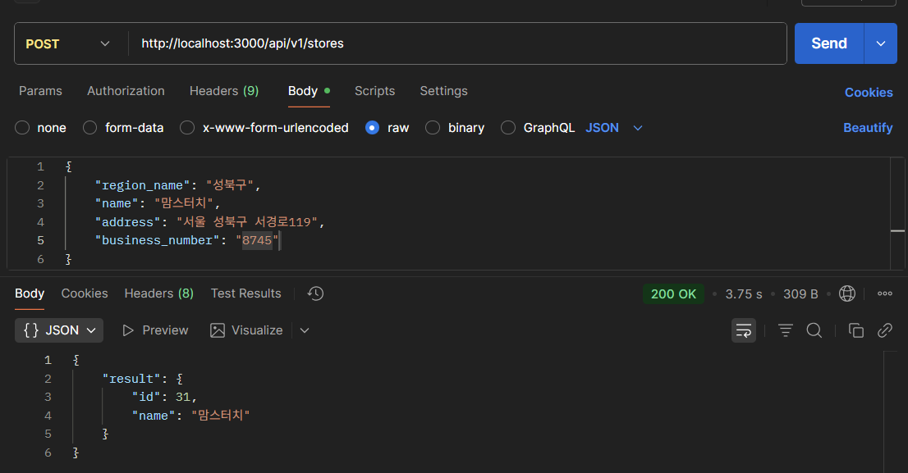

# week06-코채/유채원

- 미션 1
    
    ```jsx
    //store.repository.js
    import { prisma } from "../db.config.js";
    
    export const addStore = async (data) => {
    
      try {
        const existingStore = await prisma.store.findUnique({
          where: {businessNumber: data.business_number}
        });
    
        if (existingStore) {
          return null;
        }
    
        const region = await prisma.region.findUnique({
          where: { name: data.region_name}
        })
    
        if (!region){
          throw new Error(`지역을 찾을 수 없습니다: ${data.region_name}`);
        }
    
        // store 생성
        const newStore = await prisma.store.create({
          data: {
            businessNumber: data.business_number,
            regionId: region.id,
            name: data.name,
            address: data.address,
          }
        });
    
        return newStore.id;
    
      } catch (err) {
        throw new Error(
          `오류가 발생했어요. 요청 파라미터를 확인해주세요. (${err})`
        );
      }
    };
    export const getStore = async (storeId) => {
    
      try {
        const store = await prisma.store.findUnique({
          where: { id: storeId }
        })
    
        if (!store) {
          return null;
        }
    
        return store;
    
      } catch (err) {
        throw new Error(
          `오류가 발생했어요. 요청 파라미터를 확인해주세요. (${err})`
        );
      } 
    };
    ```
    
    **findUnique  - 빠르다**
    SQL: SELECT * FROM store WHERE id = 1;
    → Primary Key 인덱스 직접 사용
    
    **findFirst - 상대적으로 느림**
    SQL: SELECT * FROM store WHERE id = 1 LIMIT 1;
    → 일반 검색 후 LIMIT
    
    
    
    정상 작동 확인 😊
    
    ```jsx
    //review.repository.js
    import { prisma } from "../db.config.js";
    
    export const addReview = async (data) => {
      try {
        // 1. 타입 변환 (store_id 사용!)
        const storeId = parseInt(data.store_id);
    
        // 2. 가게 존재 여부 검증
        const existingStore = await prisma.store.findUnique({
          where: { id: storeId }
        });
    
        if (!existingStore) {
          return null;
        }
    
        // 3. review 생성
        const newReview = await prisma.review.create({
          data: {
            userId: 19,
            storeId: storeId,
            body: data.body,
            score: data.score,
          }
        });
    
        // 4. 평균 점수 계산
        const average = await prisma.review.aggregate({
          _avg: {
            score: true
          },
          where: {
            storeId: storeId
          }
        });
    
        const newAvgScore = average._avg.score;
    
        // 5. store 테이블에 평균 평점 업데이트
        await prisma.store.update({
          where: {
            id: storeId
          },
          data: {
            score: newAvgScore
          }
        });
    
        console.log("store 평균 평점이 " + newAvgScore + "점으로 업데이트 되었습니다.");
    
        return newReview.id;
    
      } catch (err) {
        throw new Error(
          `오류가 발생했어요. 요청 파라미터를 확인해주세요. (${err})`
        );
      }
    };
    
    export const getReview = async (reviewId) => {
      try {
        const review = await prisma.review.findUnique({
          where: { id: reviewId }
        });
    
        if (!review) {
          return null;
        }
        
        return review;
    
      } catch (err) {
        throw new Error(
          `오류가 발생했어요. 요청 파라미터를 확인해주세요. (${err})`
        );
      }
    };
    
    export const getAllStoreReviews = async (storeId, cursor) => {
      const reviews = await prisma.review.findMany({
        select: { id: true, body: true, storeId: true, userId: true },
        where: { storeId: storeId, id: { gt: cursor } },
        orderBy: { id: "asc" },
        take: 5,
      });
    
      return reviews;
    };
    ```
    
    ** param으로 넘어오는 인자가 항상 문자열로 넘어오는 문제 발생되어 parseInt로 처리
    
    
    
    ```jsx
    //mission.repository.js
    import { StatusCodes } from "http-status-codes";
    import { bodyToMission, bodyToChallenge } from "../dtos/mission.dto.js";
    import { missionCreate, challengeCreate } from "../services/mission.service.js";
    
    export const handleMissionCreate = async (req, res, next) => {
        const store_id = parseInt(req.params.storeId);  //여기서 변환
        console.log("미션을 추가했습니다!");
        console.log("body:", req.body);
        const entireMissionData = {
            ...req.body,
            store_id,  // pathvariable
        };
        console.log("entireMissionData:", entireMissionData);
    
        const mission = await missionCreate(bodyToMission(entireMissionData));
        res.status(StatusCodes.OK).json({ result: mission });
    }
    
    export const handleChallengeCreate = async (req, res, next) => {
        const mission_id = req.params.missionId;
        console.log("진행 중인 미션을 추가했습니다!");
        console.log("body:", req.body);
        const entireChallengeData = {
            ...req.body,
            mission_id,  // pathvariable
        };
    
        const challenge = await challengeCreate(bodyToChallenge(entireChallengeData));
        res.status(StatusCodes.OK).json({ result: challenge });
    }
    ```
    
    정상 작동 확인 😊
    
    
    
- 미션 2 (내가 작성한 리뷰 목록)
    - 참고 화면
        
        
        
    
    로그인 정보가 없어서 userId를 pathvariable로 받아서 설계
    
    커서 기반 페이지네이션으로 구현
    
    사용자에 더 중점적인 api라고 판단하여 users로 분리
    
    → dto 재사용으로 인해 review로 분리했어도 괜찮았을 듯
    
    ```
    //내가 작성한 리뷰 목록
    app.get("/api/v1/users/me/:userId/reviews", handleListMyReviews);
    ```
    
    ```jsx
    //user.controller.js
    export const handleListMyReviews = async (req, res, next) => {
      const reviews = await listMyReviews(
      parseInt(req.params.userId),
      typeof req.query.cursor === "string" ? parseInt(req.query.cursor) : 0  );
      res.status(StatusCodes.OK).json(reviews);
    };
    ```
    
    ```jsx
    //user.service.js
    export const listMyReviews = async (userId, cursor) => {
      const reviews = await getAllMyReviews(userId, cursor);
      return responseFromReviews(reviews);
    };
    ```
    
    ```jsx
    //user.repository.js
    export const getAllMyReviews = async (userId, cursor) => {
      const reviews = await prisma.review.findMany({
        select: {
          id: true,
          body: true,
          storeId: true,
          userId: true
        },
        where: { userId: userId, id: { gt: cursor } },
        orderBy: { id: "asc" },
        take: 5,
      });
    
      return reviews;
    };
    ```
    
    DTO는 기존 review.dto.js에 있던 걸로 재사용
    
    > cursor 인자 전달 관련
    > 
    
    ```
    //review.service.js line:20
    export const listStoreReviews = async (storeId, cursor) => {
      const reviews = await getAllStoreReviews(storeId, cursor);
      return responseFromReviews(reviews);
    };
    ```
    
    
    
- 미션 3 (특정 가게의 미션 목록)
    
    ```jsx
    //특정 가게의 미션 목록
    app.get("/api/v1/stores/:storeId/missions", handleListStoreMissions);
    ```
    
    ```jsx
    //mission.controller.js
    export const handleListStoreMissions = async (req, res, next) => {
      const missions = await listStoreMissions(
        parseInt(req.params.storeId),
        typeof req.query.cursor === "string" ? parseInt(req.query.cursor) : 0
      );
      res.status(200).json({
        result: reviews
      });
    };
    ```
    
    ```jsx
    //mission.service.js
    export const listStoreMissions = async (storeId, cursor) => {
      const missions = await getAllStoreMissions(storeId, cursor);
      return responseFromMissions(missions);
    };
    ```
    
    ```jsx
    //mission.repository.js
    export const getAllStoreMissions = async (storeId, cursor) => {
      const missions = await prisma.mission.findMany({
        select: { id: true, storeId: true, deadline: true, missionSpec: true, storeId: true },
        where: { storeId: storeId, id: { gt: cursor } },
        orderBy: { id: "asc" },
        take: 5,
      });
    
      return missions;
    };
    ```
    
    ```jsx
    //mission.dto.js
    export const responseFromMissions = (missions) => {
      return {
        data: missions,
        pagination: {
          cursor: missions.length ? missions[missions.length - 1].id : null,
        },
      };
    };
    ```
    
    
    
- 미션 4 (내가 진행 중인 미션 목록)
    
    ```jsx
    //내가 진행 중인 미션 목록
    app.get("/api/v1/missions/me/:userId/challenges", handleListMyChallenges)
    ```
    
    ```jsx
    //내가 진행 중인 미션 목록
    export const handleListMyChallenges = async (req, res, next) => {
      const challenges = await listMyChallenges(
        parseInt(req.params.userId),
        typeof req.query.cursor === "string" ? parseInt(req.query.cursor) : 0
      );
      res.status(200).json({
        result: challenges
      });
    };
    ```
    
    ```jsx
    //mission.service.js
    export const listMyChallenges = async (userId, cursor) => {
      const challenges = await getAllMyChallenges(userId, cursor);
      return responseFromMissions(challenges);
    };
    ```
    
    ```jsx
    //mission.repository.js
    export const getAllMyChallenges = async (userId, cursor) => {
      const challenges = await prisma.userMission.findMany({
        where: {
          userId: userId,
          status: "in_progress",
          id: { gt: cursor },
        },
        orderBy: { id: "asc" },
        take: 5,
        select: {
          id: true,          // UserMission id
          mission: {         // relation 통해 Mission 정보 가져오기
            select: {
              storeId: true,
              deadline: true,
              missionSpec: true,
            },
          },
        },
      });
      return challenges;
    };
    ```
    
    
    
- 미션 5 (내가 진행 중인 미션을 진행 완료로 바꾸기)
    - 참고 화면
        
        
        
    
    ```
    //미션완료처리
    app.patch("/api/v1/missions/:missionId/challenges/:userId", handleChallengeComplete);
    ```
    
    ```jsx
    export const handleChallengeComplete = async (req, res, next ) => {
        const mission_id = req.params.missionId;
        const user_id = req.params.userId;
    
        const entireCompletedChallengeData = {
            mission_id,
            user_id
        };
    
        const completedChallenge = await challengeComplete(bodyToChallenge(entireCompletedChallengeData));
        res.status(StatusCodes.OK).json({ result: completedChallenge });
    }
    ```
    
    ```jsx
    
    // 단순 조회
    export const findUserMission = async ({ userId, missionId }) => {
      return await prisma.userMission.findFirst({
        where: { userId: userId, missionId: missionId },
      });
    };
    
    // 완료 처리만
    export const updateMissionComplete = async (missionId) => {
      return await prisma.userMission.update({
        where: { id: missionId },
        data: { status: "completed" },
      });
    };
    ```
    
    ```jsx
    export const challengeComplete = async ({ userId, missionId }) => {
      // 1. 존재 여부 확인
      const userMission = await findUserMission({ userId, missionId });
    
      if (!userMission) {
        throw new Error("해당 미션에 대한 도전이 존재하지 않습니다.");
      }
    
      // 2. 이미 완료된 미션인지 확인
      if (userMission.status === "completed") {
        throw new Error("이미 완료된 미션입니다.");
      }
    
      // 3. 완료 처리
      const CompletedChallenge = await updateMissionComplete(userMission.id);
    	
    	//재사용
      return responseFromChallenge(CompletedChallenge);
    };
    ```
    
    우선 도전한 이력이 있는 지를 확인, 후에 이미 완료되지 않았는 지 검증하는 로직을 거친다.
    
    
    
    