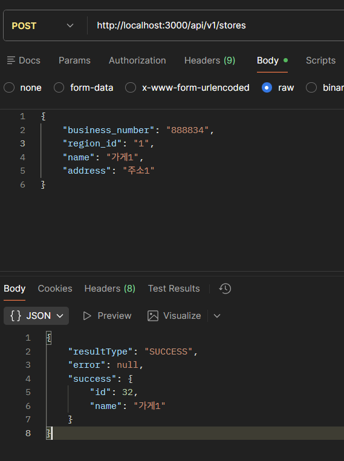

# [Week07]-코채/유채원

- 성공 응답 (표준 규격으로 잘 응답이 생성되는지 확인하고 수정)
    
    ```jsx
    //mission.controller.js
    res.status(StatusCodes.OK).success(mission);
    res.status(StatusCodes.OK).success(challenge);
    res.status(StatusCodes.OK).success(missions);
    res.status(StatusCodes.OK).success(challenges);
    res.status(StatusCodes.OK).success(completedChallenge);
    ```
    
    ```jsx
    //review.controller.js
    res.status(StatusCodes.OK).success(review);
    res.status(StatusCodes.OK).success(reviews);
    ```
    
    ```jsx
    //store.controller.js
    res.status(StatusCodes.OK).success(store);
    ```
    
    
    
    
    
    
    
    
    
    
    
    
    
    
    
    
    
    
    
    → 모든 성공 응답 형식이 통일되었습니다 😊
    
- 오류 처리 점검, 오류가 발생할 수 있는 부분들은 커스텀 Error 객체를 선언해 던지도록 리팩토링
    
    ```jsx
    //store.service.js
    if (createdStoreId === null) {
      throw new DuplicateStoreIdError("이미 존재하는 가게입니다.", data);
    }
    ```
    
    ```jsx
    //review.service.js
    if (createdReviewId === null) {
      throw new noExistsStore("해당 가게가 존재하지 않습니다.", data);
    }
    ```
    
    ```jsx
    //mission.service.js
    if (createdChallengeId === null) {
      throw new missionAlreadyInProgressError("이미 진행중인 미션입니다", data);
    }
    if (!userMission) {
      throw new ChallengeNotFoundError(
        "해당 미션에 대한 도전이 존재하지 않습니다.",
        data
      );
    }
    
    if (userMission.status === "completed") {
      throw new ChallengeAlreadyCompletedError("이미 완료된 미션입니다.", data);
    }
    ```
    
    ```jsx
    //errors.js
    export class DuplicateUserEmailError extends Error {
      errorCode = "U001";
    
      constructor(reason, data) {
        super(reason);
        this.reason = reason;
        this.data = data;
      }
    }
    export class DuplicateStoreIdError extends Error {
      errorCode = "U002";
    
      constructor(reason, data) {
        super(reason);
        this.reason = reason;
        this.data = data;
      }
    }
    export class NoExistsStoreError extends Error {
      errorCode = "U003";
    
      constructor(reason, data) {
        super(reason);
        this.reason = reason;
        this.data = data;
      }
    }
    export class MissionAlreadyInProgressError extends Error {
      errorCode = "U004";
    
      constructor(reason, data) {
        super(reason);
        this.reason = reason;
        this.data = data;
      }
    }
    export class ChallengeNotFoundError extends Error {
      errorCode = "U005";
    
      constructor(reason, data) {
        super(reason);
        this.reason = reason;
        this.data = data;
      }
    }
    export class ChallengeAlreadyCompletedError extends Error {
      errorCode = "U006";
    
      constructor(reason, data) {
        super(reason);
        this.reason = reason;
        this.data = data;
      }
    }
    ```
    
    
    
    
    
    
    
    → 모든 에러 응답 형식이 통일되었습니다 😊
    
- morgan, cookie-parser → app.use()로 적용
    
    
    
- 추가 리팩토링
    1. 7주차 리팩토링 진행 도중, [회원가입] 시에 선호 카테고리가 잘못된 값으로 전달되면(ex 컬럼 아예 빠짐, 문자열, 형식 불일치 등) 분명, FAIL이 뜨는데 DB에는 회원정보가 저장이 되는 문제 발생
        
        → 이를 prisma.$transaction(prismaTx)를 통해 작업을 하나의 트랜잭션으로 묶어, 문제 해결
        
    
    
    
    ```jsx
    export const userSignUp = async (data) => {
      return await prisma.$transaction(async (prismaTx) => {
        const existingUser = await prismaTx.user.findUnique({
          where: { email: data.email },
        });
        if (existingUser) {
          throw new Error("이미 존재하는 이메일입니다.");
        }
    
        const joinUserId = await addUser(
          {
            email: data.email,
            name: data.name,
            gender: data.gender,
            birth: data.birth,
            address: data.address,
            detailAddress: data.detailAddress,
            phoneNumber: data.phoneNumber,
          },
          prismaTx // 트랜잭션 전달
        );
    
        for (const preference of data.preferences) {
          await setPreference(joinUserId, preference, prismaTx);
        }
    
        const user = await getUser(joinUserId, prismaTx);
        const preferences = await getUserPreferencesByUserId(joinUserId, prismaTx);
    
        return responseFromUser({ user, preferences });
      });
    };
    ```
    
    1. 성공 응답 테스트 중, score가 입력되지 않았음에도 저장되는 문제 발견
        
        이렇게 필수응답 미입력 검증은
        
        1. 클라이언트 측에서 검증
        2. DB 검증
        3. 서버에서 검증
        
        이 필요하기 때문에, service layer에서 error 객체를 던지도록 추가함
        
    
    ```jsx
    if (data.score == null) {
        throw new ScoreNotProvidedError("점수가 입력되지 않았습니다", data);
      }
    
      if (data.score < 0 || data.score > 5) {
        throw new ScoreOutOfRangeError("점수는 0에서 5 사이여야 합니다.", data);
      }
    ```
    
    ```jsx
    export class ScoreNotProvidedError extends Error {
      errorCode = "U007";
    
      constructor(reason, data) {
        super(reason);
        this.reason = reason;
        this.data = data;
      }
    }
    export class ScoreOutOfRangeError extends Error {
      errorCode = "U008";
    
      constructor(reason, data) {
        super(reason);
        this.reason = reason;
        this.data = data;
      }
    }
    ```
    
    
    
    