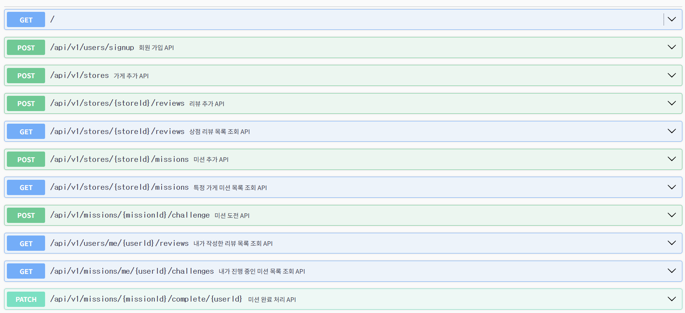

# [week08]-코채/유채원



~~회원가입, 상점 리뷰 목록 조회 제외(실습에서 진행)~~

- 가게 추가 API
    
    ```jsx
      /*
        #swagger.summary = '가게 추가 API';
        #swagger.requestBody = {
          required: true,
          content: {
            "application/json": {
              schema: {
                type: "object",
                properties: {
                  business_number: { type: "string" },
                  region_id: { type: "string" },
                  name: { type: "string" },
                  address: { type: "string" }
                }
              }
            }
          }
        };
        #swagger.responses[200] = {
          description: "가게 추가 성공 응답",
          content: {
            "application/json": {
              schema: {
                type: "object",
                properties: {
                  resultType: { type: "string", example: "SUCCESS" },
                  error: { type: "object", nullable: true, example: null },
                  success: {
                    type: "object",
                    properties: {
                      id: { type: "int" },
                      name: { type: "string" },
                    }
                  }
                }
              }
            }
          }
        };
        #swagger.responses[400] = {
          description: "가게 추가 실패 응답",
          content: {
            "application/json": {
              schema: {
                type: "object",
                properties: {
                  resultType: { type: "string", example: "FAIL" },
                  error: {
                    type: "object",
                    properties: {
                      errorCode: { type: "string", example: "U002" },
                      reason: { type: "string" },
                      data: { type: "object" }
                    }
                  },
                  success: { type: "object", nullable: true, example: null }
                }
              }
            }
          }
        };
      */
    ```
    
    
    
    
    
    
    
- 리뷰 추가 API
    
    ```
        /*
        #swagger.summary = '리뷰 추가 API';
        #swagger.requestBody = {
          required: true,
          content: {
            "application/json": {
              schema: {
                type: "object",
                properties: {
                  score: { type: "int" },
                  body: { type: "string" }
                }
              }
            }
          }
        };
        #swagger.responses[200] = {
          description: "리뷰 추가 성공 응답",
          content: {
            "application/json": {
              schema: {
                type: "object",
                properties: {
                  resultType: { type: "string", example: "SUCCESS" },
                  error: { type: "object", nullable: true, example: null },
                  success: {
                    type: "object",
                    properties: {
                      id: { type: "int" },
                      body: { type: "string" },
                      score: { type: "int" }
                    }
                  }
                }
              }
            }
          }
        };
        #swagger.responses[400] = {
          description: "리뷰 추가 실패 응답",
          content: {
            "application/json": {
              schema: {
                type: "object",
                properties: {
                  resultType: { type: "string", example: "FAIL" },
                  error: {
                    type: "object",
                    properties: {
                      errorCode: { type: "string", example: "U003" },
                      reason: { type: "string" },
                      data: { type: "object" }
                    }
                  },
                  success: { type: "object", nullable: true, example: null }
                }
              }
            }
          }
        };
      */
    ```
    
    
    
    
    
    
    
    
    
    
    
- 미션 추가 API
    
    ```
     /*
        #swagger.summary = '미션 추가 API';
        #swagger.requestBody = {
          required: true,
          content: {
            "application/json": {
              schema: {
                type: "object",
                properties: {
                  reward: { type: "int" },
                  deadline: { type: "string" },
                  mission_spec: { type: "string" }
                }
              }
            }
          }
        };
        #swagger.responses[200] = {
          description: "미션 추가 성공 응답",
          content: {
            "application/json": {
              schema: {
                type: "object",
                properties: {
                  resultType: { type: "string", example: "SUCCESS" },
                  error: { type: "object", nullable: true, example: null },
                  success: {
                    type: "object",
                    properties: {
                      deadline: { type: "string" },
                      mission_spec: { type: "string" },
                      reward: { type: "int" }
                    }
                  }
                }
              }
            }
          }
        };
        #swagger.responses[400] = {
          description: "미션 추가 실패 응답",
          content: {
            "application/json": {
              schema: {
                type: "object",
                properties: {
                  resultType: { type: "string", example: "FAIL" },
                  error: {
                    type: "object",
                    properties: {
                      errorCode: { type: "string", example: "U003" },
                      reason: { type: "string" },
                      data: { type: "object" }
                    }
                  },
                  success: { type: "object", nullable: true, example: null }
                }
              }
            }
          }
        };
    ```
    
    
    
    
    
    
    
- 특정 가게 미션 목록 조회 API
    
    ```
         /*
        #swagger.summary = '특정 가게 미션 목록 조회 API';
        #swagger.responses[200] = {
          description: "특정 가게 미션 목록 조회 성공 응답",
          content: {
            "application/json": {
              schema: {
                type: "object",
                properties: {
                  resultType: { type: "string", example: "SUCCESS" },
                  error: { type: "object", nullable: true, example: null },
                  success: {
                    type: "object",
                    properties: {
                      data: {
                        type: "array",
                        items: {
                          type: "object",
                          properties: {
                            id: { type: "number" },
                            storeId: { type: "number" },
                            deadline: { type: "string" },
                            missionSepc: { type: "string" }
                          }
                        }
                      },
                      pagination: { type: "object", properties: { cursor: { type: "number", nullable: true } }}
                    }
                  }
                }
              }
            }
          }
        };
      */
    ```
    
    
    
    
    
- 미션 도전 API
    
    ```
    /*
        #swagger.summary = '미션 도전 API';
        #swagger.requestBody = {
          required: true,
          content: {
            "application/json": {
              schema: {
                type: "object",
                properties: {
                  user_id: { type: "number" }
                }
              }
            }
          }
        };
        #swagger.responses[200] = {
          description: "미션 도전 성공 응답",
          content: {
            "application/json": {
              schema: {
                type: "object",
                properties: {
                  resultType: { type: "string", example: "SUCCESS" },
                  error: { type: "object", nullable: true, example: null },
                  success: {
                    type: "object",
                    properties: {
                      id: { type: "number" },
                      status: { type: "string" }
                    }
                  }
                }
              }
            }
          }
        };
        #swagger.responses[400] = {
          description: "미션 도전 실패 응답",
          content: {
            "application/json": {
              schema: {
                type: "object",
                properties: {
                  resultType: { type: "string", example: "FAIL" },
                  error: {
                    type: "object",
                    properties: {
                      errorCode: { type: "string", example: "U005" },
                      reason: { type: "string" },
                      data: { type: "object" }
                    }
                  },
                  success: { type: "object", nullable: true, example: null }
                }
              }
            }
          }
        };
      */
    ```
    
    
    
    
    
- 내가 작성한 리뷰 목록 조회 API
    
    ```
    /*
        #swagger.summary = '내가 작성한 리뷰 목록 조회 API';
        #swagger.responses[200] = {
          description: "내가 작성한 리뷰 목록 조회 성공 응답",
          content: {
            "application/json": {
              schema: {
                type: "object",
                properties: {
                  resultType: { type: "string", example: "SUCCESS" },
                  error: { type: "object", nullable: true, example: null },
                  success: {
                    type: "object",
                    properties: {
                      data: {
                        type: "array",
                        items: {
                          type: "object",
                          properties: {
                            id: { type: "number" },
                            store: { type: "object", properties: { id: { type: "number" }, name: { type: "string" } } },
                            user: { type: "object", properties: { id: { type: "number" }, email: { type: "string" }, name: { type: "string" } } },
                            content: { type: "string" }
                          }
                        }
                      },
                      pagination: { type: "object", properties: { cursor: { type: "number", nullable: true } }}
                    }
                  }
                }
              }
            }
          }
        };
      */
    ```
    
    
    
    
    
- 내가 진행 중인 미션 목록 조회 API
    
    ```
     /*
        #swagger.summary = '내가 진행 중인 미션 목록 조회 API';
        #swagger.responses[200] = {
          description: "내가 진행 중인 미션 목록 조회 성공 응답",
          content: {
            "application/json": {
              schema: {
                type: "object",
                properties: {
                  resultType: { type: "string", example: "SUCCESS" },
                  error: { type: "object", nullable: true, example: null },
                  success: {
                    type: "object",
                    properties: {
                      data: {
                        type: "array",
                        items: {
                          type: "object",
                          properties: {
                            id: { type: "number" },
                            storeId: { type: "number" },
                            deadline: { type: "string" },
                            missionSepc: { type: "string" }
                          }
                        }
                      },
                      pagination: { type: "object", properties: { cursor: { type: "number", nullable: true } }}
                    }
                  }
                }
              }
            }
          }
        };
      */
    ```
    
    
    
- 미션 완료 처리 API
    
    ```
      /*
        #swagger.summary = '미션 완료 처리 API';
    
        #swagger.responses[200] = {
          description: "미션 완료 처리 성공 응답",
          content: {
            "application/json": {
              schema: {
                type: "object",
                properties: {
                  resultType: { type: "string", example: "SUCCESS" },
                  error: { type: "object", nullable: true, example: null },
                  success: {
                    type: "object",
                    properties: {
                      id: { type: "int" },
                      name: { type: "string" },
                    }
                  }
                }
              }
            }
          }
        };
        #swagger.responses[400] = {
          description: "미션 완료 처리 실패 응답",
          content: {
            "application/json": {
              schema: {
                type: "object",
                properties: {
                  resultType: { type: "string", example: "FAIL" },
                  error: {
                    type: "object",
                    properties: {
                      errorCode: { type: "string", example: "U002" },
                      reason: { type: "string" },
                      data: { type: "object" }
                    }
                  },
                  success: { type: "object", nullable: true, example: null }
                }
              }
            }
          }
        };
      */
    ```
    
    
    
    
    
    
    

> 가게 존재 검증 !!
> 


```jsx
//mission.service.js
export const missionCreate = async (data) => {
  const store = await prisma.store.findUnique({
    where: { id: data.store_id },
  });

  if(store === null){
    throw new NoExistsStoreError("해당 가게가 존재하지 않습니다.");
  }
  const createdMissionId = await addMission(data);

  const mission = await getMission(createdMissionId);
  console.log("mission from getMission:", mission);

  return responseFromMission(mission);
};
```

```jsx

  //mission.repository.js
  const store = await prisma.store.findUnique({
      where: { id: storeId },
    });
    if(store===null){
      throw new NoExistsStoreError("미션 목록을 불러올 가게가 존재하지 않습니다");
    }
```