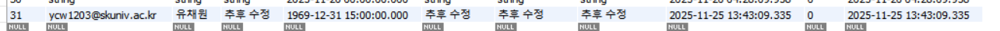

# [week09] 코채/유채원



→ 참고로 학교 메일로 구글 로그인하여 회원가입된 제 id는 31번입니다 ! 

- 기존에 사용자의 정보를 하드 코딩 했던 부분들이 있다면 수정해주세요! (ex. 항상 첫 번째 사용자를 가져와 이용했던 부분 등)
9주차 워크북에서 만든 **인증 시스템(JWT)** 을 그동안 만들었던 기존 API들에 적용하여 ‘로그인한 사용자만’ 쓸 수 있도록 보호해 주세요.
    
    ```jsx
    //리뷰 추가
    app.post("/api/v1/stores/:storeId/reviews", isLogin, handleReviewCreate);
    //미션도전
    app.post("/api/v1/missions/:missionId/challenge", isLogin, handleChallengeCreate);
    // 내가 작성한 리뷰 목록
    app.get("/api/v1/users/me/reviews", isLogin, handleListMyReviews);
    // 내가 진행 중인 미션 목록
    app.get("/api/v1/missions/me/challenges", isLogin, handleListMyChallenges);
    // 미션 완료 처리
    app.patch("/api/v1/missions/:missionId/complete", isLogin, handleChallengeComplete);
    ```
    
    우선 기존에 구현했던 api들 중 로그인이 필요한 api 5가지를 수정했습니다
    
    (단, 가게 생성과 미션생성은 관리자 전용 api라고 가정, 또한 가게의 미션 목록과 리뷰 목록은 비로그인 회원도 접근 가능하다고 가정했습니다.)
    
    1. 리뷰 추가
        
        ```jsx
        //review.controller.js
        const entireReviewData = {
                ...req.body,
                storeId,  // pathvariable
                userId: req.user.id
            };
        ```
        
        ```jsx
            // review.repository.js
            const newReview = await prisma.review.create({
              data: {
                userId: data.userId,
                storeId: storeId,
                body: data.body,
                score: data.score,
              }
            });
        ```
        
        각각 controller와 repository에 userId를 추가합니다. ( service도 일부 수정 있음 )
        
        
        
        token 잘못 입력 시에 401 unauthorized 에러가 뜨는 것을 확인할 수 있습니다
        
        
        
        
        
        google 로그인 후 token을 발급받아 authorization에 추가 시 정상적으로 200 OK가 뜨는 것을 확인할 수 있습니다. ( + DB 에도 정상적으로 저장 됨 )
        
    2. 미션 도전
        
        
        
        
        
        앞의 리뷰 추가와 마찬가지로 [userId: req.user.id] 로 소셜 로그인 된 id를 받아서 로직을 처리하고 authorization에 token을 추가하니 정상적으로 미션 도전이 되는 것을 확인할 수 있습니다.
        
    3. 내가 작성한 리뷰 목록
        
        ```
        //user.controller.js
        const reviews = await listMyReviews(
            req.user.id,
            typeof req.query.cursor === "string" ? parseInt(req.query.cursor) : 0  
          );
          res.status(StatusCodes.OK).success(reviews);
        };
        ```
        
        이 api는 로그인 id와 queryString으로 넘어오는 cursor값만 필요하기 때문에 매개변수로 넘기는 userId만 req.user.id로 변경해주면 된다.
        
        
        
    4. 내가 도전한 미션 목록
        
        ```jsx
          //mission.controller.js
          const challenges = await listMyChallenges(
            req.user.id,
            typeof req.query.cursor === "string" ? parseInt(req.query.cursor) : 0
          );
              res.status(StatusCodes.OK).success(challenges);
        };
        ```
        
        
        
    5. 미션 완료 처리
        
        ```
        //mission.controller.js
        const missionId = Number(req.params.missionId);
        const userId = req.user.id;
        
        const entireCompletedChallengeData = {
          missionId,
          userId,
        };
        ```
        
        
        
        
        
- 기존 회원 가입 API의 경우, 이메일이 이미 존재하는 사용자는 회원 가입을 막아둔 상태입니다. 일단 Google 로그인 등으로 로그인 한 사용자의 경우 전화번호, 생일 등을 채울 마땅한 방법이 없는 상태입니다.
    - 기존 회원 가입 API를 수정하여 이미 존재하는 사용자도 정보를 채워 정보를 갱신할 수 있도록 수정해주셔도 괜찮고,
    - 새로운 API를 만들어서 자기 자신의 정보를 수정하는 API를 만들어주셔도 괜찮습니다. 자유롭게 선택해주세요!
    
    정보 수정 API
    
    ```
    // 정보 수정
    app.patch("/api/v1/users/me", isLogin, handleMyInfo);
    ```
    
    ```jsx
    const user = await updateUserInfo(bodyToUser({
      ...req.body,
      userId: req.user.id,  // 로그인한 사용자 ID 추가
    }));
    ```
    
    ```jsx
    export const bodyToUser = (body) => {
      const birth = new Date(body.birth); //날짜 변환
    
      return {
        gender: body.gender || "",
        birth: birth || "",
        address: body.address || "",
        detailAddress: body.detailAddress || "", 
        phoneNumber: body.phoneNumber || "",
        preferences: body.preferences || "",
        userId: body.userId
      };
    };
    ```
    
    email (계정) 변경은 고려하지 않고, email과 name이 고정 정보라고 가정하여, 나머지 필드들만 선택적으로 수정할 수 있게 설계하였습니다.
    
    ```jsx
    export const updateUserInfo = async (data) => {
      return await prisma.$transaction(async (prismaTx) => {
      
        const updateUserId = await updateUser(
          {
            userId: data.userId,
            gender: data.gender,
            birth: data.birth,
            address: data.address,
            detailAddress: data.detailAddress,
            phoneNumber: data.phoneNumber,
          },
          prismaTx // 트랜잭션 전달
        );
    
        for (const preference of data.preferences) {
          await setPreference(updateUserId, preference, prismaTx);
        }
    
        const user = await getUser(updateUserId, prismaTx);
        const preferences = await getUserPreferencesByUserId(updateUserId, prismaTx);
    
        return responseFromUser({ user, preferences });
      });
    };
    ```
    
    ```jsx
    // User 데이터 수정
    export const updateUser = async (data, prismaTx) => {
      const db = prismaTx ?? prisma; // 트랜잭션이 있으면 사용, 없으면 기본 prisma
    
      if (!data.userId) return null; // userId 없으면 수정 불가
    
      // 사용자 조회
      const user = await db.user.findUnique({ where: { id: data.userId } });
      if (!user) return null; // 수정할 사용자가 없으면 null 반환
    
      // userId 제외하고 업데이트
      const { userId, ...updateData } = data;
    
      const updated = await db.user.update({
        where: { id: userId },
        data: updateData,
      });
    
      return updated.id;
    };
    ```
    
    하이라이트 한 부분: userId는 pk로 update하지 않는 것이 좋기 때문에 구조분해할당을 통해 제외하고 update를 진행했습니다.
    
    
    
    정상적으로 정보 수정이 되는 것을 알 수 있습니다.
    
- 관리자 ver.
    
    가게 생성과 미션 추가는 관리자가 해야하거나, 사장님이 해야하는 특정한 권한이 필요한 작업입니다.
    
    ```jsx
    //가게생성(관리자)
    app.post("/api/v1/stores", isLogin, handleStoreCreate);
    ```
    
    ```jsx
    export const generateAccessToken = (user) => {
      return jwt.sign(
        { id: user.id, email: user.email, role: user.role }, 
        secret,                           
        { expiresIn: '1h' }                 
      );
    };
    ```
    
    
    
    
    
    > payload에 role을 넣을까 말까?
    > 
    
    payload에 role 포함 시:
    
    - 토큰만 있어도 **role 정보를 바로 확인** 가능.
    - DB 조회 없이 간단한 권한 체크 가능 , 미들웨어에서 바로 권한 확인 가능
    
    ---
    
    - DB에서 role을 바꿔도, **이미 발급된 JWT에는 이전 role이 남아 있음** → 재발급 필요.
    - 권한 변경 적용을 실시간으로 반영하기 어려움.
    
    payload에 role 미포함 시:
    
    - DB에서 최신 role 정보를 가져오기 때문에 **권한 변경이 즉시 적용**됨.
    - 기존 JWT 재발급 없이도 권한 체크 가능.
    
    ---
    
    - 권한 체크할 때마다 DB 조회가 필요 → 요청마다 DB 접근 부담 발생.
    - JWT payload에 role 정보가 없으므로, DB 조회 없이는 role 확인 불가.